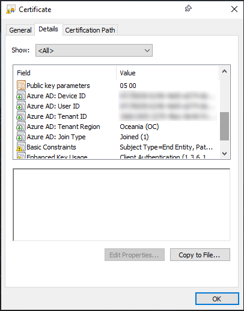

CertUiExts
==========

[](https://dev.azure.com/nexiom/CertUiExts/_build/latest?definitionId=1)
[](https://choosealicense.com/licenses/mit/)

A library which extends Windows cryptography support for displaying additional OIDs and associated certificate extensions.

- [Requirements](#requirements)
- [Setup](#setup)
  - [Installing](#installing)
  - [Uninstalling](#uninstalling)
- [Usage](#usage)
- [Object identifiers (OIDs)](#object-identifiers-oids)
  - [CA/Browser Forum](#cabrowser-forum)
  - [DigiCert](#digicert)
  - [Entrust](#entrust)
  - [Microsoft](#microsoft)
  - [Sectigo](#sectigo)
- [Security](#security)
  - [Build security](#build-security)
  - [Windows integration](#windows-integration)
- [License](#license)

Requirements
------------

- Windows Vista or Server 2008 (or later)
- Universal C Runtime (UCRT)  
  *Built-in since Windows 10 and Server 2016*

Setup
-----

### Installing

1. Download the [latest release](https://github.com/ralish/CertUiExts/releases) which matches your Windows architecture (x86 or x64)
2. Unpack the archive to a location which is read-only for non-Administrators (e.g. `C:\Program Files\CertUiExts`)
3. From an elevated command-line run the registration utility to install: `CertUiExtsReg.exe /i`

### Uninstalling

1. From an elevated command-line run the registration utility to uninstall: `CertUiExtsReg.exe /u`
2. Delete the directory in which the files were unpacked (e.g. `C:\Program Files\CertUiExts`)

Usage
-----

The library registers its supported OIDs with the Windows cryptographic services, allowing applications which use the standard operating system cryptographic APIs to benefit from the custom OID formatting functions without any changes. This capability applies to both GUI and CLI applications.

An example of the Windows certificate UI displaying Azure AD OIDs:



The same certificate displayed using the `Certutil` utility:

```plain
C:\>Certutil -dump example.cer
X509 Certificate:
Version: 3
...
Certificate Extensions: 7
    2.5.29.19: Flags = 1(Critical), Length = 2
    Basic Constraints
        Subject Type=End Entity
        Path Length Constraint=None

    2.5.29.37: Flags = 1(Critical), Length = c
    Enhanced Key Usage
        Client Authentication (1.3.6.1.5.5.7.3.2)

    1.2.840.113556.1.5.284.2: Flags = 0, Length = 13
    Azure AD: Device ID
        <snip>

    1.2.840.113556.1.5.284.3: Flags = 0, Length = 13
    Azure AD: User ID
        <snip>

    1.2.840.113556.1.5.284.5: Flags = 0, Length = 13
    Azure AD: Tenant ID
        <snip>

    1.2.840.113556.1.5.284.8: Flags = 0, Length = 5
    Azure AD: Tenant Region
        Oceania (OC)

    1.2.840.113556.1.5.284.7: Flags = 0, Length = 4
    Azure AD: Join Type
        Joined (1)
...
CertUtil: -dump command completed successfully.
```

Object identifiers (OIDs)
-------------------------

### CA/Browser Forum

| OID                | Type               | Description                                              |
| ------------------ | ------------------ | -------------------------------------------------------- |
| `2.23.140.1.1`     | Certificate Policy | Extended Validation (EV) TLS Certificate                 |
| `2.23.140.1.2.1`   | Certificate Policy | Domain Validated (DV) TLS Certificate                    |
| `2.23.140.1.2.2`   | Certificate Policy | Organization Validated (OV) TLS Certificate              |
| `2.23.140.1.2.3`   | Certificate Policy | Individual Validated (IV) TLS Certificate                |
| `2.23.140.1.3`     | Certificate Policy | Extended Validation (EV) Code Signing Certificate        |
| `2.23.140.1.4.1`   | Certificate Policy | Code Signing Certificate                                 |
| `2.23.140.1.4.2`   | Certificate Policy | Timestamping Certificate                                 |
| `2.23.140.1.5.1.1` | Certificate Policy | Mailbox Validated S/MIME Certificate (Legacy)            |
| `2.23.140.1.5.1.2` | Certificate Policy | Mailbox Validated S/MIME Certificate (Multipurpose)      |
| `2.23.140.1.5.1.3` | Certificate Policy | Mailbox Validated S/MIME Certificate (Strict)            |
| `2.23.140.1.5.2.1` | Certificate Policy | Organization Validated S/MIME Certificate (Legacy)       |
| `2.23.140.1.5.2.2` | Certificate Policy | Organization Validated S/MIME Certificate (Multipurpose) |
| `2.23.140.1.5.2.3` | Certificate Policy | Organization Validated S/MIME Certificate (Strict)       |
| `2.23.140.1.5.3.1` | Certificate Policy | Sponsor Validated S/MIME Certificate (Legacy)            |
| `2.23.140.1.5.3.2` | Certificate Policy | Sponsor Validated S/MIME Certificate (Multipurpose)      |
| `2.23.140.1.5.3.3` | Certificate Policy | Sponsor Validated S/MIME Certificate (Strict)            |
| `2.23.140.1.5.4.1` | Certificate Policy | Individual Validated S/MIME Certificate (Legacy)         |
| `2.23.140.1.5.4.2` | Certificate Policy | Individual Validated S/MIME Certificate (Multipurpose)   |
| `2.23.140.1.5.4.3` | Certificate Policy | Individual Validated S/MIME Certificate (Strict)         |

### DigiCert

| OID                       | Type               | Description                                       |
| ------------------------- | ------------------ | ------------------------------------------------- |
| `2.16.840.1.114412.1.1`   | Certificate Policy | Organization Validated (OV) TLS Certificate       |
| `2.16.840.1.114412.1.2`   | Certificate Policy | Domain Validated (DV) TLS Certificate             |
| `2.16.840.1.114412.2.1`   | Certificate Policy | Extended Validation (EV) TLS Certificate          |
| `2.16.840.1.114412.3.1.1` | Certificate Policy | Code Signing Certificate                          |
| `2.16.840.1.114412.3.2`   | Certificate Policy | Extended Validation (EV) Code Signing Certificate |
| `2.16.840.1.114412.3.11`  | Certificate Policy | Windows Kernel Driver Code Signing Certificate    |
| `2.16.840.1.114412.7.1`   | Certificate Policy | Timestamping Certificate                          |

### Entrust

| OID                          | Type               | Description                                              |
| ---------------------------- | ------------------ | -------------------------------------------------------- |
| `2.16.840.1.114028.10.1.2`   | Certificate Policy | Extended Validation (EV) SSL or Code Signing Certificate |
| `2.16.840.1.114028.10.1.3`   | Certificate Policy | Code Signing Certificate                                 |
| `2.16.840.1.114028.10.1.4.1` | Certificate Policy | Client Certificate (Class 1)                             |
| `2.16.840.1.114028.10.1.4.2` | Certificate Policy | Client Certificate (Class 2)                             |
| `2.16.840.1.114028.10.1.5`   | Certificate Policy | SSL Certificate                                          |
| `2.16.840.1.114028.10.1.6`   | Certificate Policy | Document Signing Certificate                             |
| `2.16.840.1.114028.10.1.7`   | Certificate Policy | Timestamping Certificate                                 |
| `2.16.840.1.114028.10.1.11`  | Certificate Policy | Verified Mark Certificate                                |
| `2.16.840.1.114028.10.3.5`   | Certificate Policy | Timestamping Certificate                                 |

### Microsoft

#### Active Directory

| OID                      | Type      | Description |
| ------------------------ | --------- | ----------- |
| `1.3.6.1.4.1.311.25.2`   | Extension | CA Security |
| `1.3.6.1.4.1.311.25.2.1` | Extension | Object SID  |

#### ASP.NET Core

| OID                      | Type      | Description                   |
| ------------------------ | --------- | ----------------------------- |
| `1.3.6.1.4.1.311.84.1.1` | Extension | HTTPS Development Certificate |

#### Authenticode

| OID                      | Type      | Description               |
| ------------------------ | --------- | ------------------------- |
| `1.3.6.1.4.1.311.2.1.11` | Extension | SPC Statement Type        |
| `1.3.6.1.4.1.311.2.1.12` | Extension | SPC Publisher Information |

#### Entra ID

| OID                        | Type      | Description            |
| -------------------------- | --------- | ---------------------- |
| `1.2.840.113556.1.5.284.1` | Extension | NTDS-DSA Invocation ID |
| `1.2.840.113556.1.5.284.2` | Extension | Device ID              |
| `1.2.840.113556.1.5.284.3` | Extension | User ID                |
| `1.2.840.113556.1.5.284.4` | Extension | Domain ID              |
| `1.2.840.113556.1.5.284.5` | Extension | Tenant ID              |
| `1.2.840.113556.1.5.284.7` | Extension | Join Type              |
| `1.2.840.113556.1.5.284.8` | Extension | Tenant Region          |

#### Intune

| OID                   | Type      | Description        |
| --------------------- | --------- | ------------------ |
| `1.2.840.113556.5.4`  | Extension | Device ID          |
| `1.2.840.113556.5.6`  | Extension | Account ID         |
| `1.2.840.113556.5.10` | Extension | User ID            |
| `1.2.840.113556.5.14` | Extension | Entra ID Tenant ID |

#### Time Stamping

| OID                     | Type      | Description            |
| ----------------------- | --------- | ---------------------- |
| `1.3.6.1.4.1.311.3.3.1` | Extension | Timestamping Signature |

### Sectigo

| OID                          | Type               | Description                                       |
| ---------------------------- | ------------------ | ------------------------------------------------- |
| `1.3.6.1.4.1.6449.1.2.1.1.1` | Certificate Policy | S/MIME Certificate (Class 1)                      |
| `1.3.6.1.4.1.6449.1.2.1.3.1` | Certificate Policy | TLS Certificate                                   |
| `1.3.6.1.4.1.6449.1.2.1.3.2` | Certificate Policy | Code Signing Certificate                          |
| `1.3.6.1.4.1.6449.1.2.1.3.4` | Certificate Policy | Organization Validated (OV) TLS Certificate       |
| `1.3.6.1.4.1.6449.1.2.1.3.5` | Certificate Policy | S/MIME Certificate (Class 2)                      |
| `1.3.6.1.4.1.6449.1.2.1.3.6` | Certificate Policy | S/MIME Certificate (Class 3)                      |
| `1.3.6.1.4.1.6449.1.2.1.3.8` | Certificate Policy | Timestamping Certificate                          |
| `1.3.6.1.4.1.6449.1.2.1.5.1` | Certificate Policy | Extended Validation (EV) TLS Certificate          |
| `1.3.6.1.4.1.6449.1.2.1.6.1` | Certificate Policy | Extended Validation (EV) Code Signing Certificate |
| `1.3.6.1.4.1.6449.1.2.1.6.6` | Certificate Policy | Document Signing (local)                          |
| `1.3.6.1.4.1.6449.1.2.1.6.7` | Certificate Policy | Document Signing (remote)                         |
| `1.3.6.1.4.1.6449.1.2.1.6.8` | Certificate Policy | Document Signing (external trusted partner)       |
| `1.3.6.1.4.1.6449.1.2.2.7`   | Certificate Policy | Domain Validated (DV) TLS Certificate             |

Security
--------

### Build security

The extension library and registration utility are built with support for the latest exploit mitigation features.

Compilation features:

- Buffer Security Check (`/GS`)
- Control Flow Guard (CFG) (`/guard:cf`)
- EH Continuation (EHCONT) metadata (*x64 only*) (`/guard:ehcont`)

Linker features:

- Data Execution Prevention (DEP) (`/NXCOMPAT`)
- Address Space Layout Randomisation (ASLR) (`/DYNAMICBASE`)
- High-entropy 64-bit ASLR (*x64 only*) (`/HIGHENTROPYVA`)
- Control-flow Enforcement Technology (CET) Shadow Stack (`/CETCOMPAT`)
- Reproducible (aka. deterministic) builds (`/Brepro`)

Many of these mitigations require operating system support. On older Windows releases they will simply be ignored.

Binaries are built using Azure Pipelines with the build steps located in [azure-pipelines.yml](azure-pipelines.yml).

### Windows integration

The library uses documented Windows cryptographic interfaces to support displaying additional OIDs and formatting their extension data:

- [CryptEnumOIDInfo](https://learn.microsoft.com/en-us/windows/win32/api/wincrypt/nf-wincrypt-cryptenumoidinfo)
- [CryptFindOIDInfo](https://learn.microsoft.com/en-us/windows/win32/api/wincrypt/nf-wincrypt-cryptfindoidinfo)
- [CryptFormatObject](https://learn.microsoft.com/en-us/windows/win32/api/wincrypt/nf-wincrypt-cryptformatobject)

All of these functions only take public information in certificates. Private cryptographic material is never passed to the library.

Registration and deregistration of the OID information and formatting functions is performed via the following documented APIs:

- [CryptRegisterOIDFunction](https://learn.microsoft.com/en-us/windows/win32/api/wincrypt/nf-wincrypt-cryptregisteroidfunction)
- [CryptRegisterOIDInfo](https://learn.microsoft.com/en-us/windows/win32/api/wincrypt/nf-wincrypt-cryptregisteroidinfo)
- [CryptUnregisterOIDFunction](https://learn.microsoft.com/en-us/windows/win32/api/wincrypt/nf-wincrypt-cryptunregisteroidfunction)
- [CryptUnregisterOIDInfo](https://learn.microsoft.com/en-us/windows/win32/api/wincrypt/nf-wincrypt-cryptunregisteroidinfo)

License
-------

All content is licensed under the terms of [The MIT License](LICENSE).
